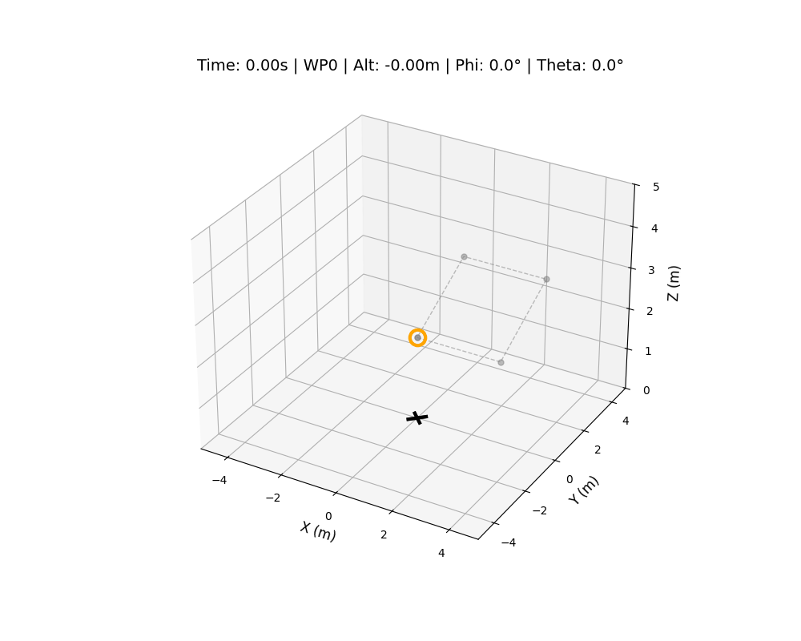

# Project Icarus

A quadcopter flight dynamics simulator built from scratch in Python, focused on 
controls, state estimation, and autonomy. The verified GNC logic is being ported 
to an embedded C++ architecture targeting a CUAV V5 Nano flight controller.



## Overview

The simulator implements a full 6-DOF rigid body model of a quadrotor with 
cascaded PID control, multi-sensor fusion, and a waypoint mission system.

### Control
- Cascaded PID architecture — outer position loop generates desired attitude 
  and thrust setpoints, passed to a high-rate inner attitude loop
- Gains derived analytically via pole placement on the linearised plant 
  (attitude: ωn = 8 rad/s; position: ωn = 1.2 rad/s; 5-10x bandwidth separation)
- Derivative-on-measurement, integral anti-windup, and tilt compensation

### State Estimation
- **Kalman Filter (translational)** — 6-state [x, y, z, vx, vy, vz] estimator 
  fusing 100 Hz IMU predictions with 5 Hz GPS and 50 Hz altimeter corrections
- **Complementary Filter (attitude)** — fuses gyroscope integration with 
  accelerometer tilt sensing, with linear acceleration compensation to prevent 
  false tilt readings during maneuvers

### Sensor Models
- Gyroscope: white noise + random-walk bias drift
- Accelerometer: body-frame specific force with noise
- GPS: 5 Hz position updates with configurable noise std dev
- Altimeter: 50 Hz with configurable noise std dev

### Verified Performance
- Steady-state position error < 8 cm during waypoint hover
- 3-meter multi-axis step response settles in < 3 seconds
- Stable through full waypoint mission with sensor noise enabled

## Roadmap

- [x] Cascaded PID control with pole-placement gains
- [x] Complementary filter attitude estimator
- [x] Kalman filter position estimator
- [x] Waypoint mission sequencing
- [x] LQR attitude control
- [ ] LQR full-state control
- [ ] Minimum snap trajectory planning
- [ ] Extended Kalman Filter (EKF)
- [ ] C++ port with MAVSDK for CUAV V5 Nano
- [ ] Hardware-in-the-Loop (HIL) testing via Raspberry Pi companion computer

## Structure
Project-Icarus/
├── simulations/
│   ├── 1d_vertical_kinematics/   # 1D altitude testbed used to validate
│   │                               thrust model before extending to 6-DOF
│   └── 6dof_full_flight/         # Full 6-DOF simulator
│       ├── main_sim.py           # Primary simulator (KF + CF sensor fusion)
│       └── report/report.md      # Detailed system architecture and results
├── fsw/                          # Flight software (C++ / MAVSDK) — in progress
├── data_analysis/
└── requirements.txt
## Getting Started

```bash
git clone https://github.com/brandonjacobson/Project-Icarus.git
cd Project-Icarus
pip install -r requirements.txt
python simulations/6dof_full_flight/main_sim.py
```

## Dependencies

- numpy
- matplotlib
- scipy
- Pillow
