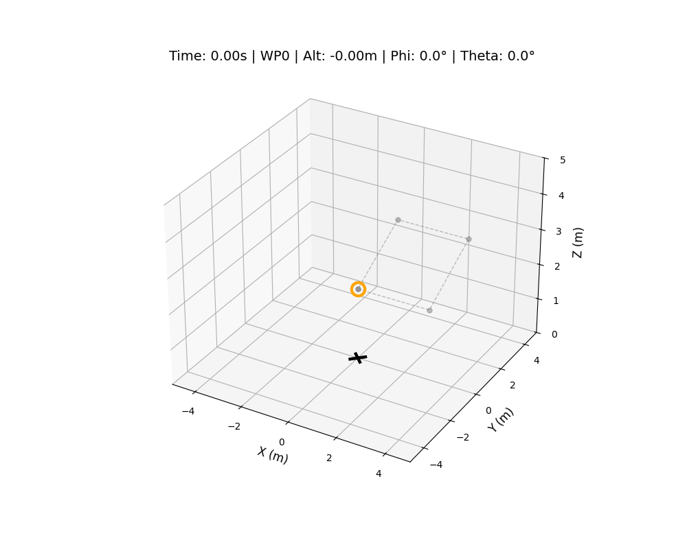

# Project Icarus

A quadcopter GNC testbed built from scratch: a full 6-DOF Python flight dynamics simulator with optimal control and multi-sensor state estimation, now flying on custom hardware. The verified GNC logic is being ported to embedded C++ targeting a CUAV V5 Nano flight controller with a Raspberry Pi companion computer.



## Highlights

- **Full-state LQR optimal control** — a single 12-state regulator `[x, y, z, vx, vy, vz, phi, theta, psi, p, q, r]` jointly optimizing position and attitude. Gains synthesized by solving the Continuous Algebraic Riccati Equation, with Q/R weights initialized via Bryson's rule and closed-loop stability verified by eigenvalue analysis.
- **Benchmarked three controller architectures** — baseline cascaded PID, cascaded PID + LQR attitude, and full-state LQR — across the same 5-waypoint autonomous mission. Full-state LQR completes the mission 32% faster than the PID baseline with final position error under 8 cm, sensor noise enabled. Full methodology and plots in the [report](simulations/6dof_full_flight/report.md).
- **Multi-rate sensor fusion** — 6-state Kalman filter fusing 100 Hz IMU predictions with 5 Hz GPS and 50 Hz altimeter corrections; complementary filter attitude estimation with linear-acceleration compensation to prevent tilt corruption during translation.
- **Hardware in flight test** — 400 mm-class quadcopter (2212 980KV, 4S) with CUAV V5 Nano and Raspberry Pi companion computer over UART/MAVLink. First powered flight attempts underway.

## Architecture

### Control
The primary controller is a full-state LQR. The plant is linearized about hover: horizontal acceleration couples through attitude (`vx_dot = g*theta`, `vy_dot = -g*phi`), vertical through collective thrust, and angular acceleration through body torques. Thrust and torque commands are allocated to individual motors through a pseudo-inverse mixer, then passed through first-order motor lag dynamics with RPM saturation.

A key finding from the benchmark: the cascaded PID + LQR architecture is limited by a hard bandwidth-separation constraint — the outer position loop cannot be made aggressive regardless of inner-loop quality. Full-state LQR removes this constraint by optimizing the coupled system in a single cost function.

The cascaded PID baseline is retained in `main_sim.py`: pole-placement gains on the linearized plant (attitude wn = 8 rad/s, position wn = 1.2 rad/s, 5-10x bandwidth separation), derivative-on-measurement, IIR derivative filtering, and conditional anti-windup.

### State Estimation
- **Kalman filter (translational)** — 6-state `[x, y, z, vx, vy, vz]`, constant-acceleration process model driven by world-frame accelerometer input, asynchronous GPS (x, y) and altimeter (z) measurement updates at their native rates.
- **Complementary filter (attitude)** — gyro integration blended with accelerometer tilt sensing. The KF's linear-acceleration estimate is fed back to correct the accelerometer's tilt reading, breaking the positive-feedback loop that otherwise corrupts attitude during horizontal maneuvers. Yaw currently uses truth passthrough (magnetometer fusion is on the roadmap).

### Sensor Models
Gyroscope (white noise + random-walk bias drift), accelerometer (body-frame specific force with noise), 5 Hz GPS, and 50 Hz altimeter — all with configurable noise statistics.

## Hardware

| Component | Choice |
|---|---|
| Frame | 400 mm-class X quadcopter |
| Propulsion | 2212 980KV motors, 4S LiPo |
| Flight controller | CUAV V5 Nano (PX4) |
| Companion computer | Raspberry Pi, UART to TELEM2, MAVLink via MAVProxy |
| Mounts | Parametric 3D-printed tower mount (OpenSCAD) |

Status: build complete, companion-computer link established, flight test campaign underway. Build log and test notes coming to this repo.

## Results

Plots in [`simulations/6dof_full_flight/images/`](simulations/6dof_full_flight/images/) and the full write-up in the [report](simulations/6dof_full_flight/report.md):
- 5-waypoint mission trajectory: position tracking, attitude, and motor RPM histories
- Kalman filter convergence: estimate vs. truth vs. raw GPS/altimeter measurements
- Three-way controller benchmark: PID vs. cascade LQR vs. full-state LQR

## Roadmap

- [x] 1D vertical dynamics testbed
- [x] 6-DOF rigid body simulation with motor dynamics
- [x] Cascaded PID control (pole-placement gains)
- [x] Complementary filter attitude estimation
- [x] Kalman filter position estimation
- [x] Waypoint mission sequencing
- [x] LQR attitude control
- [x] Full-state LQR (CARE, Bryson's rule)
- [x] Hardware build (V5 Nano + Raspberry Pi companion)
- [ ] First sustained hover (flight test underway)
- [ ] Extended Kalman Filter (nonlinear attitude-position coupling, yaw from magnetometer)
- [ ] Minimum-snap trajectory planning
- [ ] C++ flight software port (MAVSDK) for companion-computer control
- [ ] Hardware-in-the-loop testing

## Structure

```
Project-Icarus/
├── simulations/
│   ├── 1d_vertical_kinematics/     # 1D altitude testbed — thrust model validation
│   └── 6dof_full_flight/
│       ├── main_sim_lqr.py         # Full-state LQR (primary)
│       ├── main_sim.py             # Cascaded PID + LQR attitude variant
│       ├── main_sim_unfiltered_pid.py  # PID baseline (no estimation)
│       ├── report.md               # Architecture, methodology, benchmark results
│       └── images/                 # Mission and estimation plots
├── fsw/                            # Embedded C++ flight software (in progress)
├── data_analysis/
└── requirements.txt
```

## Running

```
pip install -r requirements.txt
python simulations/6dof_full_flight/main_sim_lqr.py
```

Prints closed-loop eigenvalues, a per-waypoint mission summary (arrival and settling times, final position error), and renders tracking plots, KF-vs-truth plots, and a 3D mission animation.
